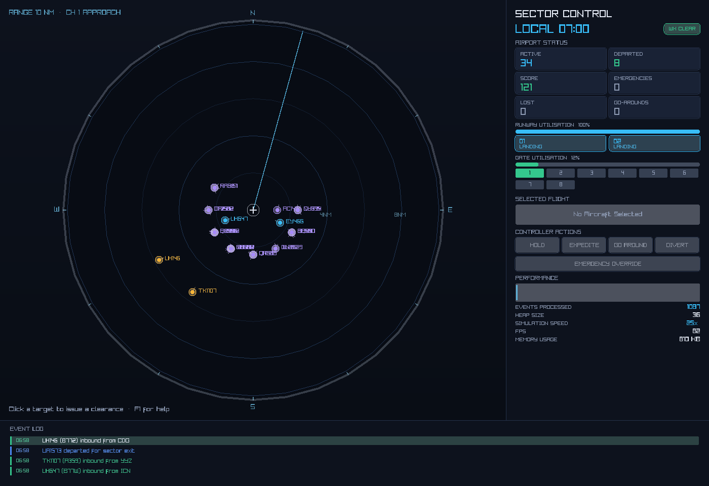

# Sector Control

A discrete-event airport traffic simulator written in C, with a real-time
radar scope rendered through [raylib](https://www.raylib.com/).

The simulator does not run on a fixed game loop. Time is advanced by a binary
min-heap priority queue: the clock jumps directly to the timestamp of the next
scheduled event. The rendering layer runs independently at 60 FPS and
interpolates aircraft positions between event anchors, so the scope stays smooth
while the scheduler resolves traffic as fast as the event stream allows.



## Quick start

```sh
cmake -B build
cmake --build build
./build/sector_control          # Windows: build\Release\sector_control.exe
```

CMake fetches and builds raylib automatically if it isn't already installed —
no manual dependency setup. See [Building](#building) for OS-specific notes
(Linux needs a few X11/GL dev packages) and [Running](#running) for CLI flags,
controls, and headless/batch modes.

## What it models

- **Real-world traffic.** Every flight draws a plausible identity from a
  curated dataset of actual airlines (United, Lufthansa, Emirates, Singapore,
  IndiGo, …), in-service ICAO aircraft types with their wake categories
  (A320, B77W, A359, E190, …), and major origin airports (LHR, DXB, SIN, JFK,
  …). The full table lives in [`src/dataset.c`](src/dataset.c).
- **Arrivals** enter the sector on a Poisson process (exponential
  interarrival times) and request a runway.
- **Runways** (1–4) are exclusive resources held for landing or takeoff.
- **Gates** (1–12) handle turnaround; aircraft taxi in, sit for servicing,
  then taxi back out for departure.
- **Wake-turbulence separation**: heavier aircraft hold a runway longer. The
  occupancy time scales with the ICAO wake category (Light / Medium / Heavy /
  Super) carried by each real aircraft type.
- **Weather** drifts between `CLEAR`, `WINDY`, and `STORM`. Worse weather
  lengthens runway occupancy and raises the chance of a go-around.
- **Go-arounds (missed approaches)**: a fraction of landings are waved off —
  randomly (more often in bad weather) or on the controller's command — and
  re-enter the holding pattern.
- **Holding patterns** absorb arrivals when every runway is busy. Aircraft in
  holding keep burning fuel.
- **Fuel emergencies**: fuel decays as `F(t) = F0 − α·Δt`. Below a threshold an
  aircraft declares an emergency and preempts the landing queue. If it drops to
  critical before a runway opens, it is recorded as lost.
- **Deadlock avoidance**: arrivals that land but find no free gate wait on the
  taxiway instead of locking a runway, so inbound traffic is never blocked by
  full gates.
- **Controller score**: a running performance score rewards clean, low-delay
  departures and penalises losses, diversions, emergencies, and go-arounds.

Every spawned aircraft is conserved: it ends `DEPARTED`, `LOST`, or (only on a
controller command) `DIVERTED` — never stranded. The `DEPARTED + LOST ==
SPAWNED` invariant is checked in the automated test suite, including under
deliberate saturation.

## Building

Requires CMake ≥ 3.16 and a C11 compiler. raylib is fetched and built
automatically if it is not already installed — no manual dependency setup.

```sh
cmake -B build
cmake --build build
```

### macOS (including Apple Silicon)

```sh
xcode-select --install        # if you don't already have the toolchain
brew install cmake
cmake -B build && cmake --build build
./build/sector_control
```

### Linux

```sh
# Debian/Ubuntu: raylib needs X11/GL dev headers to build from source
sudo apt install build-essential cmake libgl1-mesa-dev libx11-dev \
     libxrandr-dev libxinerama-dev libxcursor-dev libxi-dev
cmake -B build && cmake --build build
./build/sector_control
```

### Windows

Use the Visual Studio CMake integration, or:

```sh
cmake -B build
cmake --build build --config Release
build\Release\sector_control.exe
```

## Running

```sh
./build/sector_control                          # default scenario
./build/sector_control --scenario rush          # a preset busy-hour scenario
./build/sector_control --runways 1 --gates 4 --rate 0.5    # busy single runway
./build/sector_control --headless --seed 42     # one run, prints a report
./build/sector_control --runs 50 --scenario rush > runs.csv  # 50-seed CSV sweep
```

Options:

| flag           | meaning                                       | default |
|----------------|-----------------------------------------------|---------|
| `--seed N`     | PRNG seed (runs are fully reproducible)       | 1       |
| `--runways N`  | number of runways, 1–4                        | 2       |
| `--gates N`    | number of gates, 1–12                         | 8       |
| `--rate F`     | mean minutes between arrivals                 | 1.5     |
| `--horizon F`  | stop spawning after this many sim minutes     | 720     |
| `--scenario S` | preset: `calm`, `rush`, `storm`, `night`      | —       |
| `--headless`   | no window; run to completion, print a report  | off     |
| `--csv`        | with `--headless`, print one CSV row instead  | off     |
| `--runs N`     | run N consecutive seeds headless → CSV table  | 1       |
| `--snapshot F` | render a single frame to PNG file `F` and exit | —      |

### Batch analysis

`--runs N` runs `N` consecutive seeds to completion and emits a CSV table
(`spawned, departed, lost, diverted, emergencies, go_arounds, mean_wait,
peak_wait, score, …`), which makes it easy to sweep configurations and compare
outcomes in a spreadsheet or notebook without ever opening a window.

### Operations dashboard

The interface is a full ops console, not just a scope. The radar takes the
left ~70% of the window; a card-based dashboard fills the rest:

- **Sector control** — the simulated local clock and a weather badge (`CLEAR`
  / `WINDY` / `STORM`).
- **Airport status** — six KPI cards: flights active, departed, controller
  score, emergencies, losses, and go-arounds.
- **Resource usage** — runway and gate utilisation bars, per-runway status
  chips (`IDLE` / `LANDING` / `TAKEOFF` / `LOCKED`), and gate occupancy
  (green = occupied, blue = reserved, grey = vacant).
- **Selected flight** — callsign, airline, aircraft type, origin/destination,
  a live fuel bar, wake category, current state, queue wait, and priority for
  whichever aircraft you've clicked on the scope.
- **Controller actions** — Hold / Expedite / Go-around / Divert buttons plus
  the emergency-only Override button described below.
- **Performance** — a sparkline of events processed, alongside heap size,
  simulation speed, FPS, and an estimated memory footprint.
- A bottom **event log** narrating arrivals, clearances, holds, go-arounds,
  and emergencies in real time, colour-coded by category with the newest
  entry highlighted.

On the scope itself, only callsigns are shown by default — selecting an
aircraft (click it) brightens its label and adds a pulsing highlight ring so
you can track it without the display getting noisy.

### Controls

| key / mouse | action                         |
|-------------|--------------------------------|
| `Click`     | select an aircraft on the scope |
| `E`         | **expedite** the selected flight (priority for the next runway) |
| `H`         | **hold** the selected inbound (send to the holding pattern) |
| `D`         | **divert** the selected flight to an alternate field |
| `G`         | **go-around** — wave off the selected flight on final |
| `Space`     | pause / resume                 |
| `1 2 3 4`   | time warp 1× / 5× / 25× / 100× |
| `R`         | reset with a new seed          |
| `F1`        | toggle the in-app reference / legend |
| `Esc`       | quit                           |

The same four commands (expedite / hold / divert / go-around) are also
available as buttons in the **Controller Actions** panel. A fifth button,
**Emergency Override**, only lights up once a flight has actually declared a
fuel emergency — it's the same expedite clearance, scoped to critical traffic
so it can't be used to jump a routine queue.

### Controller decisions

The scope is interactive: click any blip to pull its details into the
**Selected flight** card — callsign, airline, aircraft type, origin,
destination, fuel, wake category, and queue wait. From there you (the
controller) make sequencing decisions instead of only watching:

- **Expedite** bumps a holding aircraft to the front of the landing queue; the
  next runway to open serves it first.
- **Hold** sends an inbound into the holding pattern, deferring it behind other
  traffic.
- **Divert** releases any resources the aircraft holds and sends it to an
  alternate, recorded in the `diverted` tally.
- **Go-around** waves a flight off short final; it re-enters the pattern and
  tries again.

Emergencies still preempt everything automatically — your expedite never jumps
ahead of a fuel-critical aircraft. Every decision is scored, so the running
**controller score** reflects how well you are sequencing traffic.

## Architecture

Three independent layers:

```
  src/pqueue.c   binary min-heap priority queue   (push/pop O(log N))
  src/rng.c      xoshiro256** PRNG, seed-reproducible
  src/dataset.c  real-world airline / aircraft / airport reference data
  src/sim.c      event-driven core: resources, contention, fuel, decisions
  src/render.c   raylib radar scope + card-based operations dashboard
  src/main.c     CLI / mode selection
```

`atc_core` (queue + rng + sim) has no graphics dependency and is compiled on
its own for the test target, so the simulation logic can be exercised in CI
without a display.

### Data structures

The whole simulator is built out of a small set of classic, hand-rolled data
structures — no STL/containers library, just plain C arrays and structs:

| Data structure | Implementation | Where | Purpose | Complexity |
|---|---|---|---|---|
| **Event priority queue** | Binary min-heap on a dynamic array (doubles on overflow) | [`pqueue.c`](src/pqueue.c) | Always know the next event to fire — this *is* the simulation clock | push `O(log n)`, pop `O(log n)`, peek `O(1)` |
| **Holding-pattern queue** | Circular ring buffer (array + `head`/`tail`/`len`) | [`sim.c`](src/sim.c) | FIFO of aircraft stacked in the hold, waiting on a runway | push/pop `O(1)`; priority-aware extraction `O(n)` over a tiny ring |
| **Taxiway wait queue** | Circular ring buffer | [`sim.c`](src/sim.c) | FIFO of aircraft that landed but found every gate full | push/pop `O(1)` |
| **Rolling event log** | Circular buffer, fixed capacity, overwrites oldest | [`sim.c`](src/sim.c) / [`sim.h`](include/sim.h) | Last 48 log lines behind the live event-log ticker | insert `O(1)`, indexed read-by-recency `O(1)` |
| **Aircraft table** | Flat fixed-size array (object pool, 4096 slots) | [`types.h`](include/types.h) | Every flight in the run, indexed directly by flight id | access `O(1)` |
| **Runway / gate tables** | Flat fixed-size arrays | [`sim.h`](include/sim.h) | Exclusive-resource state per runway/gate | access `O(1)` |
| **PRNG state** | 4×`uint64_t` xoshiro256\*\* state | [`rng.c`](src/rng.c) | Seeded, reproducible randomness for interarrivals and dataset draws | `O(1)` per draw |
| **Aircraft / Simulation / SimStats** | Plain structs (records) | [`types.h`](include/types.h), [`sim.h`](include/sim.h) | Aggregate all per-flight and per-run state into one value | — |

Two design choices are worth calling out for a viva:

- **The heap's comparator is a total order, not just a timestamp compare.**
  Ties are broken first by `priority_weight` (emergency → landing → takeoff →
  routine) and then by insertion sequence, so two events scheduled for the
  exact same simulated minute still resolve deterministically instead of
  depending on heap-internal ordering.
- **The holding queue isn't strict FIFO.** `holding_pop_priority()` does a
  linear scan over the (small, capped) ring: if any aircraft in the hold has
  declared a fuel emergency, the most fuel-critical one is pulled regardless
  of arrival order; otherwise a controller-expedited flight jumps the queue;
  otherwise it's plain FIFO. The ring is then compacted back around the
  removed slot.

### Determinism

The event ordering is a total order: earliest timestamp first, ties broken by
priority weight, then by insertion sequence (FIFO). Combined with the seeded
PRNG, a given seed and configuration always produces an identical run — useful
for debugging and for regression tests.

## Tests

```sh
cmake --build build
ctest --test-dir build --output-on-failure
# or directly:
./build/test_core
```

Covered: heap ordering and tie-breaking, a 100k-event heap stress check, PRNG
determinism, run-to-run reproducibility, and flow conservation under both
normal and saturated load.

Run under Valgrind for a clean memory report:

```sh
valgrind --leak-check=full ./build/test_core
```

## License

MIT. See [LICENSE](LICENSE).
